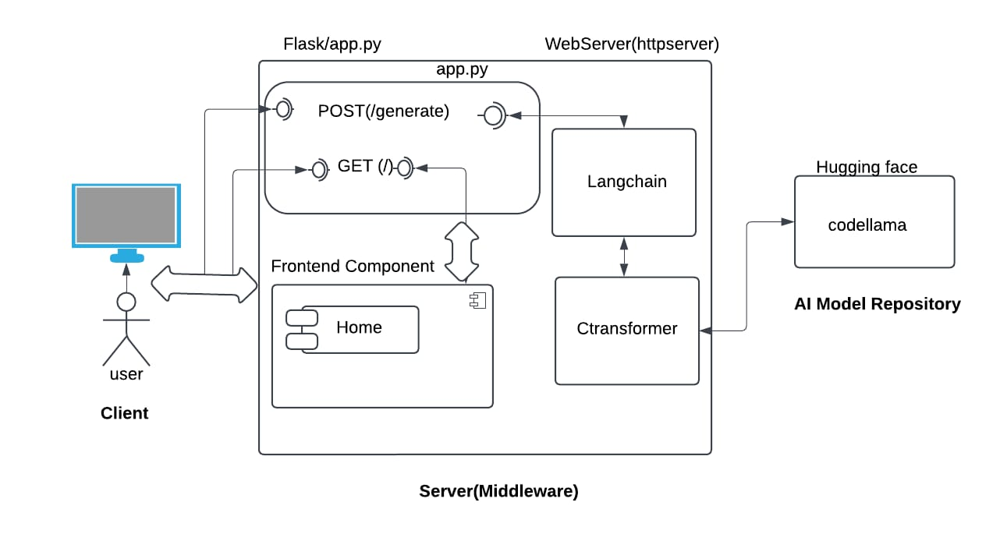

# Optimized Code Generator

## Overview
The **Optimized Code Generator** is a 2-tier application designed to generate high-quality, efficient code based on user-provided descriptions, time complexity, and programming language preferences. This project utilizes advanced AI models for code generation, integrating a user-friendly React frontend, a Flask backend API, and deep learning models like **CodeLLaMA** powered by **CTransformers**.

## Features
- **Frontend**:
  - React-based user interface.
  - Input fields for code description, desired time complexity, and programming language.
  - Displays the generated code.
  - Handles errors gracefully.

- **Backend**:
  - Flask REST API for handling client requests.
  - Integration with LangChain for structured prompt creation.
  - Utilizes **CTransformers** for invoking the **CodeLLaMA** model to generate code.

- **AI Model**:
  - CodeLLaMA model for advanced code generation.
  - Supports various programming languages and time complexities.

## Architecture
#Architecture Diagram of the project


- **React**: Collects user inputs and sends them to the backend.
- **Flask**: Processes the request and interacts with LangChain and CTransformers.
- **LangChain**: Formats the prompt for the CodeLLaMA model.
- **CTransformers**: Loads and invokes the CodeLLaMA model to generate code.
- **CodeLLaMA**: Generates the requested code based on the input description.

## Prerequisites
- Python 3.8 or later
- React (via create-react-app or equivalent setup)
- Flask and required Python dependencies
- CodeLLaMA model file

## Installation

### Backend
1. Clone the repository:
   ```bash
   git clone https://github.com/your-repo/optimized-code-generator.git
   cd optimized-code-generator/backend
   ```
2. Create a virtual environment and activate it:
   ```bash
   python -m venv venv
   source venv/bin/activate # On Windows: venv\Scripts\activate
   ```
3. Install the dependencies:
   ```bash
   pip install -r requirements.txt
   ```
4. Download the CodeLLaMA model file and configure its path in `app.py`:
   ```python
   model='path_to_your_model/codellama-7b-instruct.Q4_K_M.gguf'
   ```
5. Run the Flask server:
   ```bash
   python app.py
   ```

### Frontend
1. Navigate to the frontend directory:
   ```bash
   cd ../frontend
   ```
2. Install dependencies:
   ```bash
   npm install
   ```
3. Start the React development server:
   ```bash
   npm start
   ```

### Running the Application
1. Start the Flask backend.
2. Start the React frontend.
3. Access the application in your browser at `http://localhost:3000`.

## API Endpoints
### `POST /generate`
**Description**: Generates code based on input.

**Request Body**:
```json
{
  "input_text": "<description>",
  "timeComplexity": "<complexity>",
  "language": "<language>"
}
```

**Response**:
```json
{
  "response": "<generated_code>"
}
```

## Technologies Used
- **Frontend**: React, Axios
- **Backend**: Flask, Flask-CORS, LangChain, CTransformers
- **Model**: CodeLLaMA

## Future Enhancements
- Add user authentication and history tracking.
- Deploy the application using Docker and CI/CD pipelines.
- Expand support for additional AI models and more complex code generation tasks.

## License
This project is licensed under the MIT License. See the `LICENSE` file for details.

## Contributing
Contributions are welcome! Please fork the repository and create a pull request to contribute changes.

---
**Happy Coding!**
